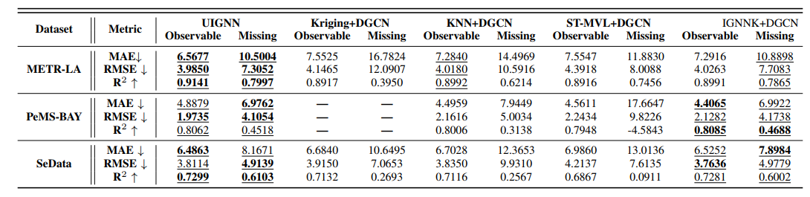

# UIGNN
This is the official code base of paper "Uncertainty-aware Traffic Prediction under Missing Data" in ICDM 2023
### Abstract
Traffic prediction is a crucial topic because of its broad scope of applications in the transportation domain. Though recent studies have achieved promising results, most of them cannot adequately deal with positions with no historical data, which is common due to limited resources in real life. Apart from this, the lack of uncertainty measurements also makes current models unable to manage risks, especially for the downstream tasks involving decision-making. Inspired by the previous inductive graph neural network, we proposed an uncertainty-aware framework to 1) extend prediction to locations with no historical records and significantly extend spatial coverage of prediction while reducing sensor deployment and 2) generate probabilistic prediction with uncertainty quantification to help the risk management. The experiment results show that our method achieved promising results on prediction tasks, and the uncertainty quantification gives consistent results that highly correlate with the locations with and without historical data. We also show that our model could help support sensor deployment tasks in the transportation field to achieve higher accuracy with a limited sensor deployment budget. 

## Requirements
To install required packages, please use:
```
pip install -r requirements.txt
```


## Dataset
This repository shows a sample dataset: SeData. To use it, unfold the 'mat.zip' and put it under UIGNN/data/sedata. For more datasets we use, please send an email to ljx201806@stu.xjtu.edu.cn.

## Training & Testing
To train a UIGNN model without recover loss, use `main.py`(updating)

To train a UIGNN model with recover loss, use `main_full_graph.py`  --This is the file containing our whole methods reported in our paper.

Active learning methods are also preovided in `active_method_simple.py`

## Results


## Citation
If you find our model useful, please cite our paper:
```
@misc{mei2023uncertaintyaware,
      title={Uncertainty-aware Traffic Prediction under Missing Data}, 
      author={Hao Mei and Junxian Li and Zhiming Liang and Guanjie Zheng and Bin Shi and Hua Wei},
      year={2023},
      eprint={2309.06800},
      archivePrefix={arXiv},
      primaryClass={cs.LG}
}
```

